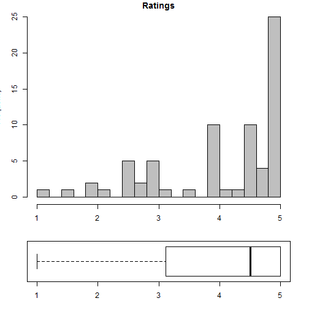
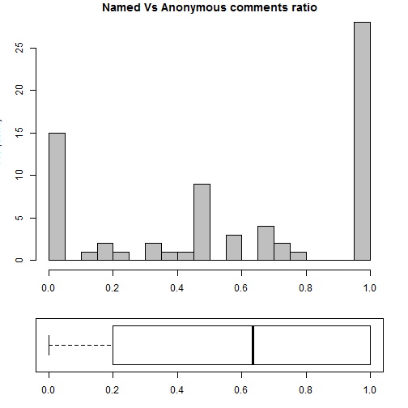
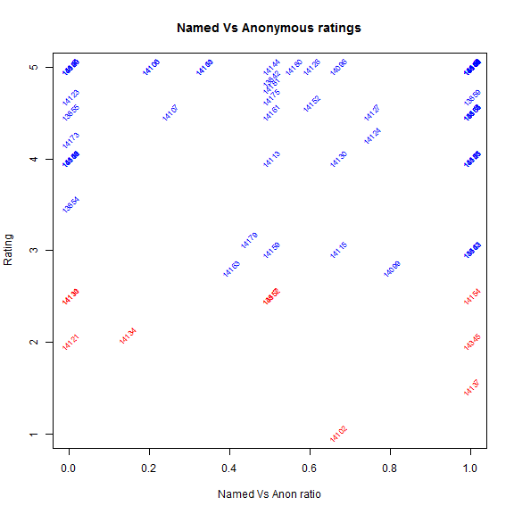
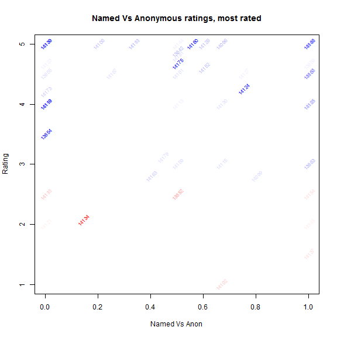
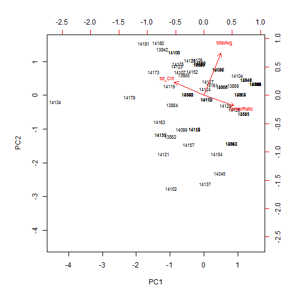
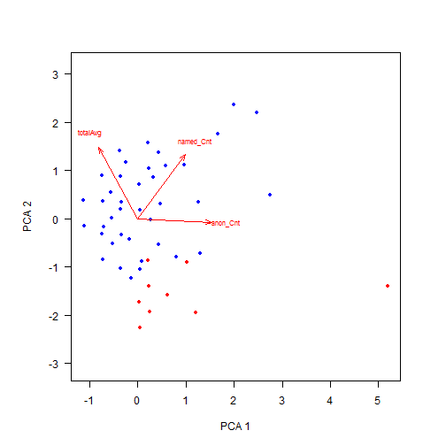

An exercise in named versus anonymous comment analysis using Java 8 Stream API and R.

# Executive summary
A few days after Codemotion Rome 2015 - a very interesting Italian Tech Conference - a little conversation has started on social media, arguing on the solidity and validity of anonimous comments and anonimous ratings of the several talks which held at the conference. My perspective is that attendees left anonimous feedbacks for reasons which are different than lack-of-personal-confidence or, in some cases, trolling; this analysis also because I wanted some real data to exercise over Java 8 Stream API and R. This is to support my thesis that anonymous comments and feedbacks have their relevance in this case.

# Introduction

Setting the goals:

* Exercise with __Java 8 Stream API__ including custom Collector
* Exercise with __R__ and R markdown
* Back with data my thesis that anonymous feedbacks have relevance in the case illustrated above

Non-goals:

* Java code to be idiomatic FP style
* Idiomatic statistical analysis

# Case study: Event ID# 3347
This is case study of comments Event ID 3347 on `joind.in` which is Codemotion Rome 2015.

## Sourcing the data with Java 8
The Java code consume the `joind.in` API in order to cycle on the Event's talks, fetching all the comments for each talk and filtering out anonymous ratings which have repeated comment text, possibly clicked on upload form multiple times? Java 8 stream API is very helpful to process this data in streams and perform some custom pre-aggregations to be used later in the analysis.
Technologies used: JAX-RS with RESTeasy, Jackson for JSON tree walking with Java 8 stream API.

## Data load and preparation in R
Loading the data from the Java generated code


```r
mDF <- read.csv("data/20150404200655/3347/stats.csv", header=FALSE, col.names=c("id", "h_avg", "h_commentCnt", "h_starCnt", "anon_Cnt", "named_Cnt", "anonAvg", "namedAvg", "totalAvg"))
```

Introducing a new column in the data frame to represent the ratio of named comment Vs anonymous comment.


```r
mDF$namedRatio <- mDF$named_Cnt / (mDF$named_Cnt+mDF$anon_Cnt)
```

Keeping only those talks which have at least a comment/feedback


```r
mDF <- mDF[mDF$anon_Cnt+mDF$named_Cnt > 0,]
mDF$tot_Cnt <- mDF$anon_Cnt+mDF$named_Cnt
summary(mDF)
```

```
##        id            h_avg        h_commentCnt      h_starCnt
##  Min.   :13842   Min.   :0.000   Min.   : 1.000   Min.   :0  
##  1st Qu.:14097   1st Qu.:3.000   1st Qu.: 1.000   1st Qu.:0  
##  Median :14124   Median :4.000   Median : 2.000   Median :0  
##  Mean   :14073   Mean   :3.486   Mean   : 3.129   Mean   :0  
##  3rd Qu.:14145   3rd Qu.:5.000   3rd Qu.: 4.000   3rd Qu.:0  
##  Max.   :14345   Max.   :5.000   Max.   :16.000   Max.   :0  
##     anon_Cnt        named_Cnt        anonAvg         namedAvg    
##  Min.   : 0.000   Min.   :0.000   Min.   :0.000   Min.   :0.000  
##  1st Qu.: 0.000   1st Qu.:1.000   1st Qu.:0.000   1st Qu.:1.625  
##  Median : 1.000   Median :1.000   Median :2.500   Median :4.000  
##  Mean   : 1.386   Mean   :1.571   Mean   :2.362   Mean   :3.228  
##  3rd Qu.: 2.000   3rd Qu.:2.000   3rd Qu.:4.625   3rd Qu.:5.000  
##  Max.   :12.000   Max.   :5.000   Max.   :5.000   Max.   :5.000  
##     totalAvg       namedRatio        tot_Cnt      
##  Min.   :1.000   Min.   :0.0000   Min.   : 1.000  
##  1st Qu.:3.208   1st Qu.:0.2125   1st Qu.: 1.000  
##  Median :4.500   Median :0.6333   Median : 2.000  
##  Mean   :4.079   Mean   :0.5932   Mean   : 2.957  
##  3rd Qu.:5.000   3rd Qu.:1.0000   3rd Qu.: 4.000  
##  Max.   :5.000   Max.   :1.0000   Max.   :14.000
```

```r
row.names(mDF) = mDF$id
```

### Ratings

A quick look at the ratings:



From `joind.in` API: *rating: A rating from 1-5 where 5 is the best and 1 is rubbish*.

Data suggest a vast amount of the talks have been very positively enjoyed by the attendees, confirming once again the success of the event!

### Named Vs Anonymous ratio

A quick look at the Named Vs Anonymous comments ratio:



Data suggest anonymous comments and rating are a very meaningful population in the dataset, hence shall not be excluded in the futher analysis. 

### Named and Anonymous ratings

A visual attempt to highlight distribution of data, considering Named Vs Anonymous ration and total average rating. To help visually distinguish positively-rated talks from negatively-rated talk, the following threshold are set:


```r
low <- mDF$totalAvg <= 2.5   # negatively-rated talk, red
high <- mDF$totalAvg > 2.5   # positibely-rated talk, blue
```


### More on Named and Anonymous ratings

A visual attempt, as above, but also to highlight most commented talks: the more commented, the less transparent the label:



# Conclusions
Data suggest anonymous comments and rating are a very meaningful population in the dataset, moreover visual representation highlight how anonymous feedback is relevant for a number of positively-rated talk, hence with this data at hand, I'm not convinced on the argumentation that anonymity is an alibi for lack-of-confidence or trolling. Further explanation could be that attendees are not keen in sign-up to yet another social network just to leave feedbacks, and/or that they fear personal consequences in leaving named severe critics.

* * * * 

Following notes on extensions.

# Extension
An experimentation in using principal component analysis for dimensionality reduction for representing the dataset.

 


 


